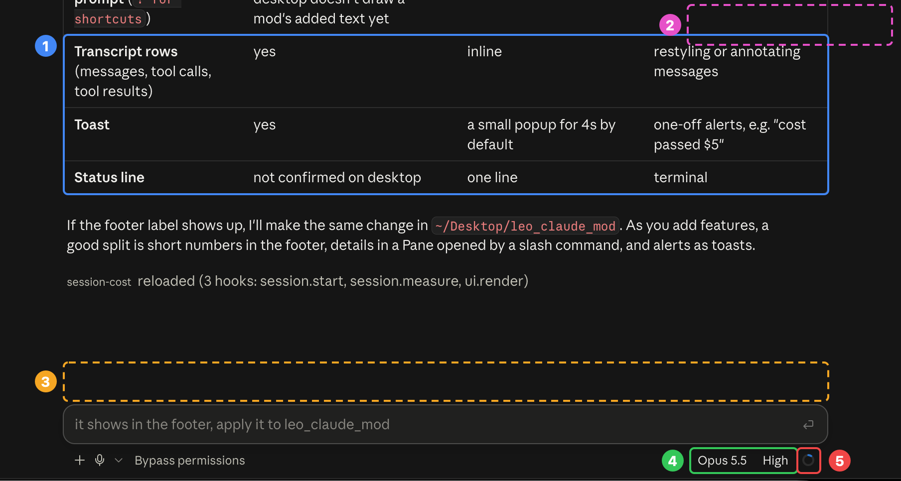

# leo_claude_mod

Leo's personal mods for Claude Code (terminal and the desktop app's Code tab), packaged as one plugin with the ID `leo-mods`.

## Features

One clean line of live session info. In the desktop app it sits above the prompt, with activity at the left and small bars at the right:

```
active 12m · 2 agents     cache ▬▬▬▬▭ 42m   ctx ▬▬▬▭▭ 42%   5h ▬▭▭▭▭ 23%   7d ▬▭▭▭▭ 12%   $0.1268
```

In the terminal it's one footer label, with text bars:

```
active 12m · 2 agents · cache ▰▰▰▰▱ 42m · ctx ▰▰▱▱▱ 42% · 5h ▰▱▱▱▱ 23% · 7d ▱▱▱▱▱ 12% · $0.13
```

(See [Where a mod can draw](#where-a-mod-can-draw) for why the two differ.)

| Part | What it shows | File |
| --- | --- | --- |
| `active 12m` | Time Claude has spent working this session: the main conversation's turn durations added up (not time since the session opened). Counted from when the plugin loads, which is the session start in a new session. | `hooks/features/activity.ts` |
| `2 agents` | Subagents running right now; hidden when none are. | `hooks/features/activity.ts` |
| `cache` | How long the prompt cache stays warm: a bar that drains (green, then amber under 40% left, red under 15%) and the minutes left, or a red `cold · new session?` once it expired. A toast also tells you when it expires: your next message then re-reads the whole conversation at full price, so for a new task a new session is cheaper. | `hooks/features/usage.ts` |
| `ctx` | How full the context window is. Near 100%, the conversation gets compacted. | `hooks/features/usage.ts` |
| `5h` / `7d` | How much of your subscription's 5-hour and 7-day usage limits you've used. Hidden off a subscription (API key). | `hooks/features/usage.ts` |
| `$0.1268` | The session's total cost: green under $50, amber under $100, red from $100. | `hooks/features/usage.ts` |

Each bar has its own color (ctx blue, 5h violet, 7d teal), then turns amber from 50% and red from 80% (`hooks/meters.ts`). When a usage limit passes **80%**, a toast pops up (for 30 seconds) once per window, e.g. "5-hour limit at 82%, resets in 1h 20m".

Usage numbers are read when the session starts and updated after each turn.

**How the cache countdown works.** Each response from the main conversation restarts the prompt cache's timer, and the bar stays full while a turn runs. The TTL follows Claude Code's own rule: `CLAUDE_CODE_PROMPT_CACHE_TTL`, then the `promptCacheTtl` setting, then **1 hour** on a Claude subscription within its usage limits and **5 minutes** on an API key, Bedrock or Vertex. The countdown keeps running while the session sits idle (re-checked every 15 seconds against the clock, so it's right after the Mac wakes too), and the last-refresh time is saved per session, so a restarted or resumed session picks it back up. It's an estimate from the client side: the API doesn't report when an entry expires. Active time updates when each turn ends. The agent count refreshes when a subagent starts and when a turn ends, and every 2 seconds while any are running.

The cost is the same estimate `/cost` shows, priced at API list rates. On a Pro/Max subscription it is not what you pay.

## Install

From a terminal:

```bash
claude plugin marketplace add quango2304/leo_claude_mod
```

```bash
claude plugin install leo-mods@quango2304
```

Or inside an interactive `claude` session: `/plugin marketplace add quango2304/leo_claude_mod`, then `/plugin install leo-mods@quango2304`.

Start a new session (in the terminal or the desktop app's Code tab). The usage line appears after the first turn: in the footer in the terminal, above the prompt in the desktop app.

**Update** to the latest version:

```bash
claude plugin marketplace update quango2304
```

```bash
claude plugin update leo-mods@quango2304
```

**Uninstall:**

```bash
claude plugin uninstall leo-mods@quango2304
```

## Develop

Clone the repo and load it straight from disk instead of the installed copy, by adding it to the `env` block of `~/.claude/settings.json`:

```json
"env": {
  "CLAUDE_CODE_PLUGIN_DIRS": "/path/to/leo_claude_mod",
  "CLAUDE_CODE_PLUGIN_DIR_WATCH": "1"
}
```

`CLAUDE_CODE_PLUGIN_DIR_WATCH` makes edits reload in a running session; without it, changes apply from the next new session. Don't have the installed plugin enabled at the same time, or both copies load and the usage line shows twice (`claude plugin disable leo-mods@quango2304`).

To publish a change, bump `version` in `.claude-plugin/plugin.json` so `claude plugin update` picks it up.

## Layout

```
leo_claude_mod/
├── .claude-plugin/
│   ├── plugin.json              manifest (plugin ID "leo-mods")
│   └── marketplace.json         makes this repo installable as marketplace "quango2304"
├── hooks/
│   ├── hooks.json               points to register.tsx
│   ├── register.tsx             wires up the features and draws their labels
│   ├── meters.ts                draws a percentage as a bar (SVG on desktop, ▰▱ in the terminal)
│   └── features/
│       ├── usage.ts             context %, usage limits, cost, limit alerts
│       └── activity.ts          active time, running subagents
├── types/index.d.ts             declares every value the plugin stores ($.state)
├── docs/ui-spots.png            where a mod can draw (see below)
└── tsconfig.json                editor typings (the engine writes them to .claude-plugin/types)
```

## Where a mod can draw



Solid boxes are things already on screen; dashed boxes are spots that stay empty until a mod uses them.

| # | Spot | Render component / call | Size | Good for |
| --- | --- | --- | --- | --- |
| 1 | **Transcript rows**: messages, tool calls, tool results | `UserMessage`, `AssistantMessage`, `ToolUse`, `ToolResult`, `ToolGroup`, `CommandOutput` | inline | restyling or annotating messages |
| 2 | **Toast**: a popup at the top right of the transcript | `$.ui.toast(text)` | small; disappears after 4s by default | one-off alerts, e.g. "cost passed $5" |
| 3 | **Line above the prompt** | `AbovePrompt` | a full-width box | buttons, inputs, several lines |
| 4 | **Footer labels**, next to the model and effort | `SessionMode` (add to `e.props.modes`) | a few characters | short live values, **terminal only**: the desktop app asks for them but doesn't draw them |
| 5 | **Spinner**: the turn indicator | `Spinner` | one row, only while a turn runs | live per-turn info |
| – | **Pane**: a panel the mod opens (not in the screenshot) | `$.ui.open({ id, title })` + `Pane` | docked panel, or a box above the prompt | dashboards, lists, breakdowns |

Positions 2 and 5 are approximate: they come from the API docs, not from watching a mod draw there. Spot 4 was tested: the terminal draws a mod's footer labels, but the desktop app (as of Claude Code 2.1.286) asks for them once and never draws them. That is why this plugin puts its labels in the footer in the terminal and on a line above the prompt (3) in the desktop app.

Terminal-only spots, which the desktop app doesn't draw: the hint line under the prompt (`PromptHint`'s `tail`), `TurnDuration`, `InfoNotice`, `ToolProgress`. The pinned status line (`$.ui.status`) is not confirmed on desktop.

A rough rule: short numbers go in the footer (4) in the terminal and above the prompt (3) on desktop, details in a Pane opened by a slash command, and alerts as toasts (2).

## Adding a feature

The engine scans the module before loading it and enforces these rules:

- `on` may be passed to a named function in another file, so a feature exports `register<Name>(on: On)` and puts its hooks there.
- **One hook per event per plugin** (unless the hooks use different matchers). Two features can't both hook `session.start`, so features that read the same event belong in one file; that's why context, limits and cost share `usage.ts`.
- `$` is never passed across an import, only to functions declared at the top level of the same file. A feature file's own hooks can use `$`; the combined line is drawn in `register.tsx` (`readLine`).
- Every state read/write names its `atom({ plugin: 'leo-mods', key })` in the same file, so a value the line shows is declared in the feature file (to write it) and again in `register.tsx` (to read it), with the same key.

Steps:

1. Write `hooks/features/<name>.ts` exporting `register<Name>(on)` and, if it shows something, a plain `<name>Label(value)` formatter. Use `usage.ts` as the template. If it needs an event another feature already hooks, add it to that feature instead.
2. Declare any stored value in `types/index.d.ts` under `'leo-mods'`.
3. In `register.tsx`, call `register<Name>(on)`, declare the atom with the same key, and add it in `readLine`: a percentage goes in `meters` (drawn as a bar), anything else in `labels`.
4. Validate:

```bash
claude plugin validate ~/Desktop/leo_claude_mod
```

The full API reference is in the `plugin-authoring` skill; ask Claude to load it when writing a new feature.
