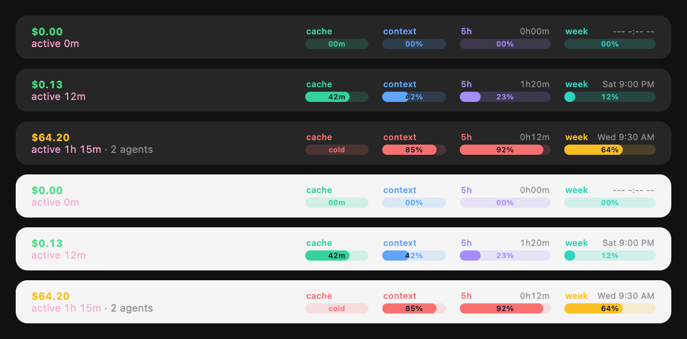

# leo_claude_mod

Leo's personal mods for Claude Code (terminal and the desktop app's Code tab), packaged as one plugin with the ID `leo-mods`.

## Features

One clean line of live session info. In the desktop app it sits above the prompt: the cost over the active time at the left, and a bar for each meter at the right, its name over it in its color and the number inside. Here it is before the first response, mid-session and near the limits, in the dark and light themes:



In the terminal it's one footer label, with text bars:

```
active 12m · 2 agents · cache ▰▰▰▰▱ 42m · context ▰▰▱▱▱ 42% · 5h ▰▱▱▱▱ 23% 1h20m · week ▱▱▱▱▱ 12% Sat 9:00 PM · $0.13
```

The desktop app doesn't draw a mod's footer labels, so there the line goes above the prompt instead.

| Part | What it shows | File |
| --- | --- | --- |
| `active 12m` | Time Claude has spent working this session: the main conversation's turn durations added up (not time since the session opened), in whole minutes. Counted from when the plugin loads, which is the session start in a new session. | `hooks/features/activity.ts` |
| `2 agents` | Subagents running right now; hidden when none are. | `hooks/features/activity.ts` |
| `cache` | How long the prompt cache stays warm: a bar that drains (green, then amber under 40% left, red under 15%) and the minutes left, or a red `cold` once it expired. A toast also tells you when it expires: your next message then re-reads the whole conversation at full price, so for a new task a new session is cheaper. | `hooks/features/usage.ts` |
| `context` | How full the context window is. Near 100%, the conversation gets compacted. | `hooks/features/usage.ts` |
| `5h` / `week` | How much of your subscription's 5-hour and weekly usage limits you've used, and when each resets: the time left for the 5-hour window (`1h20m`, ticks every minute), the day and local time for the weekly one (`Sat 9:00 PM`). Hidden off a subscription (API key). | `hooks/features/usage.ts` |
| `$0.13` | The session's total cost, in dollars and cents: green under $50, amber under $100, red from $100. | `hooks/features/usage.ts` |

Each bar has its own color (context blue, 5h violet, week teal), then turns amber from 50% and red from 80% (`hooks/meters.ts`). When a usage limit passes **80%**, a toast pops up (for 30 seconds) once per window, e.g. "5-hour limit at 82%, resets in 1h 20m" or "Weekly limit at 85%, resets Sat 9:00 PM".

Usage numbers are read when the session starts and updated after each turn; the 5-hour countdown ticks every minute. Numbers keep a fixed width (`05%`, `07m`, `1h20m`, `$0.00`) so the line doesn't shift. Until the first response, a new session shows the line with empty bars and zeros (`00m`, `00%`, `0h00m`, `--- -:-- --`, `$0.00`, `active 0m`).

**How the cache countdown works.** Each response from the main conversation restarts the prompt cache's timer, and the bar stays full while a turn runs. The TTL follows Claude Code's own rule: `CLAUDE_CODE_PROMPT_CACHE_TTL`, then the `promptCacheTtl` setting, then **1 hour** on a Claude subscription within its usage limits and **5 minutes** on an API key, Bedrock or Vertex. The countdown keeps running while the session sits idle (re-checked every 15 seconds against the clock, so it's right after the Mac wakes too), and the last-refresh time is saved per session, so a restarted or resumed session picks it back up. It's an estimate from the client side: the API doesn't report when an entry expires. Active time updates when each turn ends. The agent count refreshes when a subagent starts and when a turn ends, and every 2 seconds while any are running.

The cost is the same estimate `/cost` shows, priced at API list rates. On a Pro/Max subscription it is not what you pay.

## Install

From a terminal:

```bash
claude plugin marketplace add quango2304/leo_claude_mod
```

```bash
claude plugin install leo-mods@quango2304
```

Or inside an interactive `claude` session: `/plugin marketplace add quango2304/leo_claude_mod`, then `/plugin install leo-mods@quango2304`.

Start a new session (in the terminal or the desktop app's Code tab). The line appears right away, zeroed until the first response: in the footer in the terminal, above the prompt in the desktop app.

**Update** to the latest version:

```bash
claude plugin marketplace update quango2304
```

```bash
claude plugin update leo-mods@quango2304
```

**Uninstall:**

```bash
claude plugin uninstall leo-mods@quango2304
```

## Develop

Clone the repo and load it straight from disk instead of the installed copy, by adding it to the `env` block of `~/.claude/settings.json`:

```json
"env": {
  "CLAUDE_CODE_PLUGIN_DIRS": "/path/to/leo_claude_mod",
  "CLAUDE_CODE_PLUGIN_DIR_WATCH": "1"
}
```

`CLAUDE_CODE_PLUGIN_DIR_WATCH` makes edits reload in a running session; without it, changes apply from the next new session. Don't have the installed plugin enabled at the same time, or both copies load and the usage line shows twice (`claude plugin disable leo-mods@quango2304`).

The README's picture (`docs/preview.png`) is drawn from the plugin's own code by `bun scripts/preview.ts` (needs [Bun](https://bun.sh) and Google Chrome). A pre-commit hook redraws and stages it whenever a commit touches `hooks/`; turn it on once per clone:

```bash
git config core.hooksPath .githooks
```

To publish a change, bump `version` in `.claude-plugin/plugin.json` so `claude plugin update` picks it up.

## Layout

```
leo_claude_mod/
├── .claude-plugin/
│   ├── plugin.json              manifest (plugin ID "leo-mods")
│   └── marketplace.json         makes this repo installable as marketplace "quango2304"
├── .githooks/pre-commit         redraws docs/preview.png when the drawing code changes
├── hooks/
│   ├── hooks.json               points to register.tsx
│   ├── register.tsx             wires up the features and draws their labels
│   ├── meters.ts                draws a percentage as a bar (SVG on desktop, ▰▱ in the terminal)
│   └── features/
│       ├── usage.ts             cache countdown, context %, usage limits and resets, cost, alerts
│       └── activity.ts          active time, running subagents
├── docs/preview.png             the picture above, drawn by scripts/preview.ts
├── scripts/preview.ts           draws docs/preview.png from the plugin's own code (bun scripts/preview.ts)
├── tests/                       plugin tests (claude plugin test .)
├── types/index.d.ts             declares every value the plugin stores ($.state)
└── tsconfig.json                editor typings (the engine writes them to .claude-plugin/types)
```

## Writing mods

See the Claude Code docs on mods: https://code.claude.com/docs/en/plugins/mods
